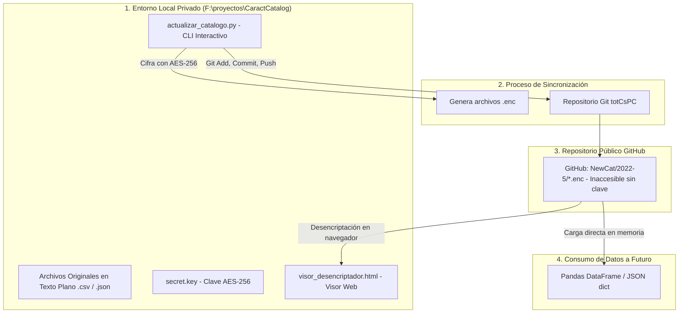

# Proyecto: Gestión, Seguridad y Consumo del Catálogo de Características (totCsPC)

## 1. Visión General
Este proyecto administra los catálogos técnicos de características y valores correspondientes a los **Acuerdos Marco y Catálogos Electrónicos de Perú Compras (Acuerdo Marco 2022-5)**. 

Para proteger la integridad y privacidad de la información técnica en un entorno de repositorio público en GitHub ([`epenaIFDT/totCsPC`](https://github.com/epenaIFDT/totCsPC)), se implementó una **arquitectura de doble capa (Local en Claro vs. Remoto Cifrado AES-256)** con herramientas automatizadas para la actualización mensual y consumo directo de datos en memoria.

---

## 2. Arquitectura del Proyecto



---

## 3. Estructura de Catálogos y Categorías (2022-5)

El acuerdo marco `2022-5` se divide en dos catálogos principales (`250-CP` y `252-CE`), con 8 subcategorías técnicas activas:

| Catálogo | Código de Carpeta | Nombre de Categoría | Archivos por Carpeta (Local) | Archivos en GitHub (Cifrado) |
| :--- | :--- | :--- | :--- | :--- |
| **250-CP** | `11743-CP` | Computadoras Portátiles | 1 `.json`, 1 `.csv` | `*.json.enc`, `*.csv.enc` |
| **250-CP** | `11744-WSP` | Workstations Portátiles | 1 `.json`, 1 `.csv` | `*.json.enc`, `*.csv.enc` |
| **250-CP** | `11745-TB` | Tablets | 1 `.json`, 1 `.csv` | `*.json.enc`, `*.csv.enc` |
| **252-CE** | `11735-CE` | Computadoras de Escritorio | 1 `.json`, 1 `.csv` | `*.json.enc`, `*.csv.enc` |
| **252-CE** | `11736-TU` | Computadoras Todo en Uno | 1 `.json`, 1 `.csv` (Pendiente) | `*.json.enc`, `*.csv.enc` |
| **252-CE** | `11740-ET` | Estaciones de Trabajo | 1 `.json`, 1 `.csv` | `*.json.enc`, `*.csv.enc` |
| **252-CE** | `11741-MN` | Monitores IT | 1 `.json`, 1 `.csv` | `*.json.enc`, `*.csv.enc` |
| **252-CE** | `11749-PI` | Pantallas Interactivas | 1 `.json`, 1 `.csv` | `*.json.enc`, `*.csv.enc` |

---

## 4. Componentes y Herramientas Implementadas

### A. Entorno Local (`F:\proyectos\CaractCatalog\`)
- **`2022-5/`**: Copia de seguridad y espacio de trabajo local con los archivos originales en texto plano (`.json` y `.csv`).
- **`secret.key`**: Archivo que contiene la clave secreta AES-256 (Fernet). **Nunca se debe compartir ni subir a repositorios públicos**.
- **`actualizar_catalogo.py`**: Interfaz de consola interactiva para sincronizar, encriptar, consultar estado y subir a GitHub.
- **`crypto_loader.py`**: Módulo Python con la clase `CryptoLoader` para cargar datasets directamente en memoria.
- **`visor_desencriptador.html`**: Aplicación web cliente autónoma que descarga de GitHub y desencripta en el navegador.

### B. Repositorio Remoto (`totCsPC`)
- **`NewCat/2022-5/`**: Estructura de carpetas idéntica que contiene **únicamente** archivos `.enc` (datos inaccesibles sin la clave).
- **`.gitignore`**: Configurado para impedir la subida accidental de claves (`*.key`, `*.secret`, `.env`) o archivos de texto plano dentro de `NewCat/2022-5/`.
- **`scripts/`**: Contiene `actualizar_catalogo.py` y `crypto_loader.py`.
- **`docs/guia_seguridad.md`**: Documentación técnica en el repositorio.

---

## 5. Manual de Operaciones

### 5.1 Flujo de Actualización Mensual (Paso a Paso)
Cada mes, cuando se generen los nuevos catálogos técnicos:

1. **Pegar los 2 archivos nuevos:**
   Copia el nuevo `.json` y `.csv` en la carpeta correspondiente dentro de `F:\proyectos\CaractCatalog\2022-5\` (por ejemplo, en `252-CE\11735-CE\`).
   > *Nota: No importa si el nombre del archivo cambia (por timestamps o fechas), el script detecta los nuevos archivos y limpia las versiones anteriores en el repositorio.*

2. **Ejecutar el Gestor Interactivo:**
   Abre una terminal (PowerShell o CMD) y ejecuta:
   ```powershell
   cd F:\proyectos\CaractCatalog
   python actualizar_catalogo.py
   ```

3. **Seleccionar la Opción 1:**
   - Selecciona `1. [Sincronizar y Subir a GitHub]`.
   - El script cifrará automáticamente cada archivo hacia la carpeta del repositorio Git.
   - Te pedirá confirmación (`s`) para hacer el commit y push automático a GitHub.

---

### 5.2 Menú del Script Interactivo (`actualizar_catalogo.py`)

Al ejecutar el script verás el siguiente menú:

```text
===========================================================================
        GESTOR INTERACTIVO DE CATÁLOGO Y SINCRONIZACIÓN CIFRADA
===========================================================================
Carpeta Local (Texto Plano):  F:\proyectos\CaractCatalog\2022-5
Repositorio Git (Cifrado):    C:\Users\epena.MYINGSAIFDT\totCsPC\NewCat\2022-5
Clave Secreta Local:          F:\proyectos\CaractCatalog\secret.key (Existe: SÍ)
---------------------------------------------------------------------------
MENÚ PRINCIPAL:
  1. [Sincronizar y Subir a GitHub]     (Cifra archivos locales -> Actualiza Repo -> Git Push)
  2. [Ver Estado de Archivos]           (Compara archivos locales vs encriptados en Repo)
  3. [Probar Carga de Datos en Memoria] (Demuestra lectura con Pandas sin tocar disco)
  4. [Restaurar / Desencriptar a Local] (Recupera archivos planos desde los .enc del Repo)
  5. [Ver / Respaldar Clave Secreta]
  0. [Salir]
---------------------------------------------------------------------------
```

---

### 5.3 Cómo Consumir Datos Cifrados en Python (Data Loader)

Para consumir la información en análisis de datos, notebooks o pipelines sin necesidad de escribir archivos desencriptados en disco:

```python
from crypto_loader import CryptoLoader

# 1. Instanciar el cargador (detecta automáticamente secret.key)
loader = CryptoLoader(key_path=r"F:\proyectos\CaractCatalog\secret.key")

# 2. Cargar CSV cifrado directamente a Pandas DataFrame
ruta_csv_enc = r"C:\Users\epena.MYINGSAIFDT\totCsPC\NewCat\2022-5\252-CE\11735-CE\catalogo_caracteristicas_1787260422431(ce).csv.enc"
df = loader.read_csv(ruta_csv_enc)

print(f"Dimensiones: {df.shape[0]} filas x {df.shape[1]} columnas")
print(df.head())

# 3. Cargar JSON cifrado directamente a dict o list
ruta_json_enc = r"C:\Users\epena.MYINGSAIFDT\totCsPC\NewCat\2022-5\252-CE\11735-CE\catalogo_caracteristicas_1787260422403(ce).json.enc"
data_json = loader.read_json(ruta_json_enc)
print(f"Total características cargadas: {len(data_json)}")
```

---

### 5.4 Uso del Visor Web (`visor_desencriptador.html`)

Para consultar o validar datos desde cualquier navegador:

1. Abre el archivo [`F:\proyectos\CaractCatalog\visor_desencriptador.html`](visor_desencriptador.html) en tu navegador.
2. Selecciona la categoría que deseas consultar en el menú desplegable.
3. Pega la clave de desencriptación (`secret.key`).
4. Presiona **"⚡ Descargar, Desencriptar y Mostrar"**.
5. Podrás buscar en tiempo real, filtrar por procesador/marca/característica y descargar el CSV si lo necesitas.

---

## 6. Diccionario de Datos (Estructura de Columnas)

### Archivos CSV de Características (`*.csv` / `*.csv.enc`):
| Nombre de Columna | Tipo | Descripción | Ejemplo |
| :--- | :--- | :--- | :--- |
| `ID_Caracteristica` | Entero | Identificador único de la característica técnica | `26211` |
| `Nombre_Caracteristica`| Texto | Nombre del atributo o componente | `"PROCESADOR"`, `"MEMORIA_RAM"` |
| `ID_Valor` | Entero | Identificador único del valor específico | `1740443` |
| `Nombre_Valor` | Texto | Descripción técnica del valor | `"PROCESADOR: INTEL CORE I7-13700"` |

### Archivos JSON de Características (`*.json` / `*.json.enc`):
Estructura jerárquica con el arreglo de características y su lista de valores anidados:
```json
[
  {
    "id_caracteristica": "26211",
    "nombre_caracteristica": "PROCESADOR",
    "valores": [
      {
        "id_valor": "1740443",
        "nombre_valor": "PROCESADOR: INTEL CORE I7-13700"
      }
    ]
  }
]
```

---

## 7. Estado Actual del Proyecto
- **Repositorio Git:** Sincronizado en la rama `main` con cifrado AES-256 activo.
- **Entorno Local:** `F:\proyectos\CaractCatalog\` con respaldo completo de los 14 archivos originales (2 por carpeta), scripts interactivos y clave de seguridad.
- **Seguridad:** `.gitignore` activo en el repositorio para evitar fugas de información.


---

## 8. Skills y Subagentes Especializados

Para este proyecto se han configurado **Skills**, **Reglas de Contexto** y **Subagentes** que operan de forma autónoma:

### 8.1 Skill: `catalog-crypto-sync`
- **Ubicación:** [`.agents/skills/catalog-crypto-sync/SKILL.md`](.agents/skills/catalog-crypto-sync/SKILL.md)
- **Propósito:** Provee la guía operativa y procedimientos para el cifrado mensual, sincronización con GitHub y consumo seguro en memoria.

### 8.2 Subagente: `catalog_crypto_agent`
- **Rol:** Criptógrafo y Administrador de Sincronización Segura.
- **Función:** Audita que ningún archivo en texto plano ni clave secreta se suba a GitHub, valida procesos de cifrado AES-256 y verifica la coherencia entre local y remoto.

### 8.3 Subagente: `catalog_data_analyzer`
- **Rol:** Analista de Datos Técnicos de Catálogos Electrónicos.
- **Función:** Carga datasets `.enc` directamente en memoria con Pandas (`CryptoLoader`) para realizar cruces, filtros por procesador/RAM/marcas y generar reportes analíticos sin exponer datos en claro a disco.

### 8.4 Reglas del Proyecto: `catalog-rules`
- **Ubicación:** [`.agents/rules/catalog-rules.md`](.agents/rules/catalog-rules.md) y [`AGENTS.md`](AGENTS.md)
- **Función:** Establece directivas estrictas para impedir la subida de claves secretas y preservar la arquitectura de dos capas.
